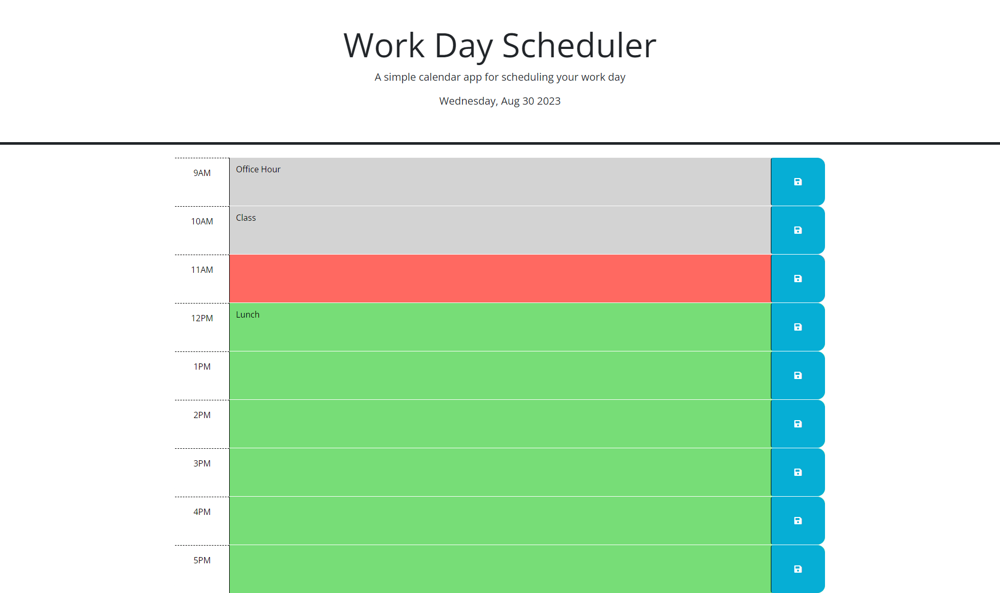

# 05-Work-Day-Scheduler-Challenge-5

## Description
The purpose of this project was to build a dynamic work day scheduler that allows the user to save items according to the time they want. On revisiting the site or refreshing it, the save items will populate in the same area they were saved in. The dynamic part of this project is updating the background color to indicate if that hour is in the past, present or future. The challenges faced in this project were to link and apply third party APIs. The most difficult part was understanding each APIs advantages and weaknesses and leveraging it to complete my application. 

A link to the deployed application can be found [here](https://kyleochata.github.io/05-Work-Day-Scheduler-Challenge-5/).

Screenshot of Active application (Grey block = past, red = present, green = future)

## Installation

Locate a suitable place where you would like to download this repository. Once found, copy the repositories SSH or HTTPS to clone through the terminal or download the zipfile from GitHub. After it is downloaded, right-click the index file and launch with your preferred internet browser.

While in the browser, feel free to examine the HTML and CSS code in developer mode by hitting F12 or right-clicking the screen and navigating to inspect.

## Usage

This repository is allowed for use in a learning environment to evaluate and analyze.

## Credits

Credits are given to the following:

* UCI full-stack coding bootcamp for the acceptance criteria for the project.

* AskBCS and their array of assistants that helped me out with technical questions when they arose.

*JQuery for usage of their [API](https://jquery.com/)

*DayJS for usage of their [API](https://day.js.org/)